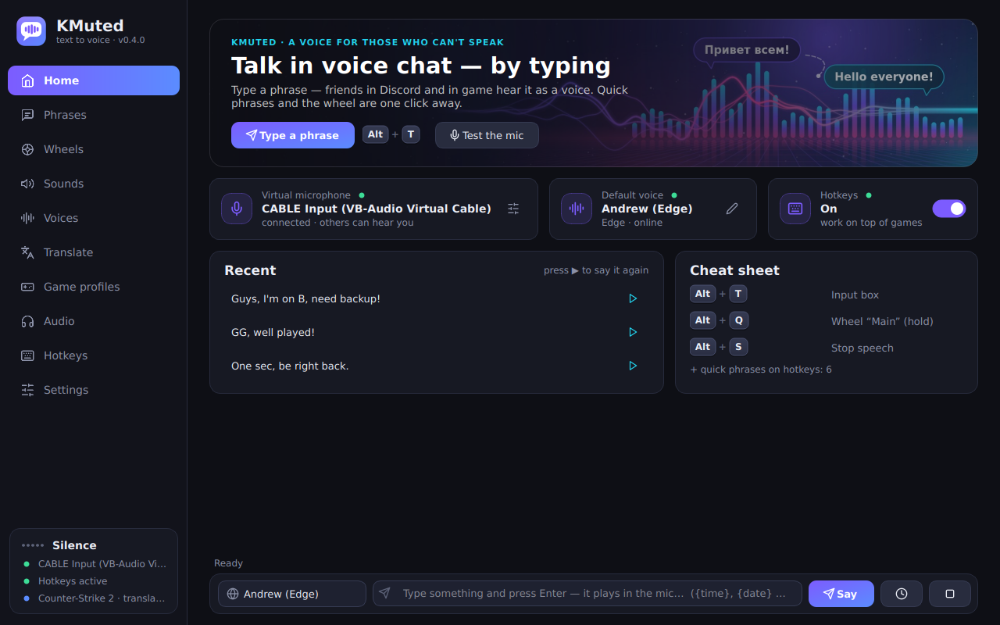
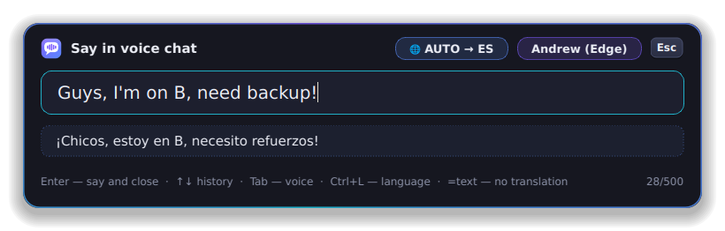
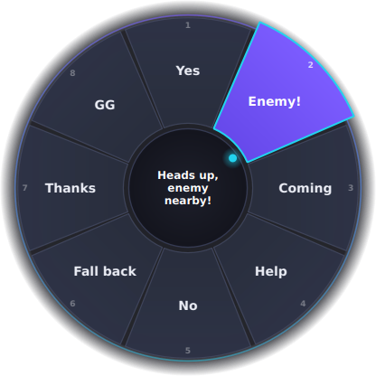
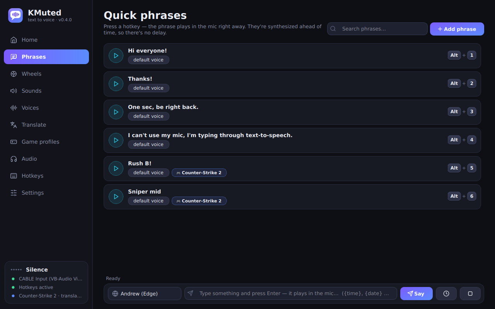
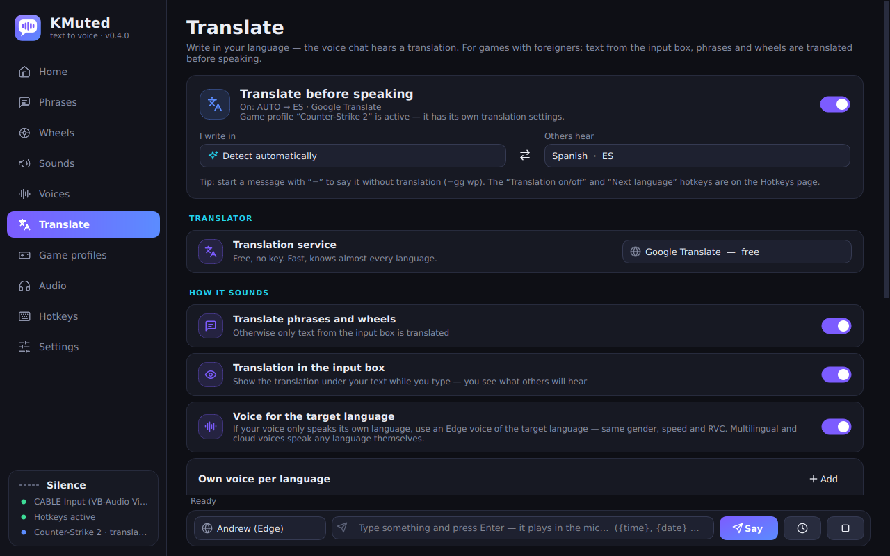
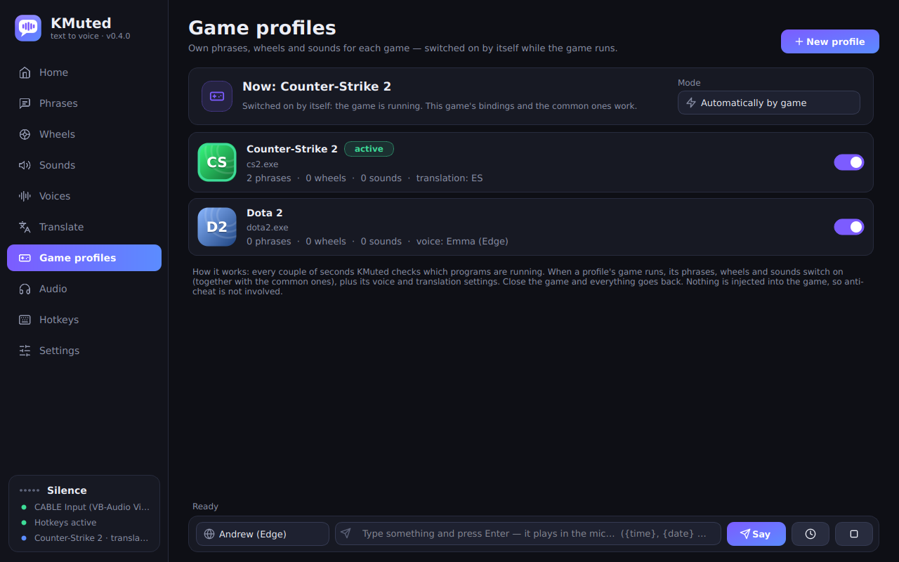

<p align="center">
  
</p>

# KMuted

[Русский](README.md) · **English**

**Talk in voice chat without saying a word.** KMuted reads your text aloud in the voice you pick
and sends it straight into your microphone — like sounds in Soundpad. Friends in Discord or in
game hear a voice instead of reading the chat. Playing with people who speak another language?
KMuted translates for you too.

Made for people who can't use their mic (someone is sleeping, no voice, shyness, muteness) but
still want to take part in voice chat.

**Version 0.4.0** · Windows 10 / 11 (64-bit) · free · English and Russian interface

| | |
|---|---|
|  |   |

## Contents

- [Quick start](#quick-start)
- [What's new](#whats-new)
- [Features](#features)
- [How it works](#how-it-works)
- [Installation and setup](#installation)
- [Usage](#usage)
- [Auto-translation](#auto-translation)
- [Game profiles](#game-profiles)
- [Voices](#voices)
- [App settings](#app-settings)
- [Troubleshooting](#troubleshooting)
- [Privacy](#privacy)
- [For developers](#for-developers)

## Quick start

1. **[⬇ Download KMuted (ZIP)](https://github.com/MarinZXCArtist/KMuted/archive/HEAD.zip)** — or the green **Code → Download ZIP** button on the
   repository page.
2. Unzip it (right-click → "Extract All…") and open the folder.
3. Double-click **`run.bat`**. The first start installs Python (if you don't have it) and everything
   else by itself — 2–5 minutes, internet needed. After that `run.bat` starts KMuted in seconds.
4. On KMuted's **Home** page click **Download and install VB-Cable** (a virtual microphone, needed
   once) and restart your PC.
5. In Discord or in your game, choose **CABLE Output** as the microphone.
6. Press `Alt + T`, type "Hello everyone!" and press `Enter` — your friends hear a voice.

The interface language follows your Windows language; change it in Settings → **Interface language**.

> Windows may say "Windows protected your PC" — click **More info → Run anyway**. That happens with
> any file from the internet that has no paid code signature.

Next: put your own phrases on hotkeys (**Phrases** page), set up the wheel (`Alt + Q`), turn on
translation (**Translate** page) and create a profile for your game (**Game profiles**).

## What's new

**0.4.0**
- 🌐 **Auto-translation** before speaking: type in your language, the voice chat hears another one
  (28 languages). Google and MyMemory for free; DeepL, Claude and OpenAI with an API key.
- 🎮 **Game profiles**: your own phrases, wheels and sounds switch on by themselves while a game runs.
- Phrase, wheel and sound editors got a **Works in** field (everywhere, or only in chosen games).
- New artwork: the Home banner and the wheel center (drawn by code).
- Tray menu: "Translate before speaking" toggle; the sidebar shows the active profile and language.
- `run.bat` installs Python (via `winget`) and the libraries by itself — just download the ZIP and run it.

**0.3.0** — soundboard (mp3/wav on hotkeys), cloud voices (ElevenLabs, OpenAI, Azure, Google,
Yandex), English interface, installer and auto-updates, a Hotkeys page to bind everything,
`{time}`-style variables, repeat last phrase, `.kmuted` packs, live level meters.

**0.2.0** — new animated design, less memory, bug fixes.
**0.1.0** — first release: quick phrases, wheel, input box, Edge / Windows / Piper voices, RVC.

## Features

| | |
|---|---|
| 💬 **Quick phrases** | Write your own phrases and put them on hotkeys. Press — the phrase is spoken. Phrases are synthesized in advance, so they play instantly. |
| 🎡 **Phrase wheel** | Hold a key — a wheel with 4–12 phrases appears in the middle of the screen. Move the mouse towards a phrase and release — it's spoken. You can have several wheels. |
| ⌨️ **Input box** | A hotkey opens a text box in the middle of the screen: type, press Enter — it's spoken. ↑↓ for history, Tab to switch voice. |
| 🌐 **Auto-translation** | Type in Russian (or any language) — the voice chat hears English, Spanish or any of 28 languages. The input box, phrases and wheels are translated; you see the translation under your text while typing; the voice matches the language. Free (Google, MyMemory) or higher quality with DeepL, Claude, OpenAI. |
| 🎮 **Game profiles** | Own set of phrases, wheels and sounds for each game: start CS2 — your CS2 callouts switch on; close it — your usual bindings are back. A game can also switch the voice and translation language. 28 popular games built in, or pick any running program. |
| 🗣 **Voices** | Microsoft Edge neural voices (hundreds of them in ~80 languages), Windows voices, offline Piper voices. Speed, pitch, volume. |
| 🧬 **Custom voices** | Your own Piper models (`.onnx`) and **RVC models from voice changers** (`.pth` + `.index`). |
| ☁️ **Cloud voices** | ElevenLabs, OpenAI, Microsoft Azure, Google Cloud, Yandex SpeechKit — pick from a list; needs your own API key (stored encrypted). |
| 🔊 **Sounds and memes** | Soundboard: your mp3 / wav / ogg / flac files on hotkeys, straight into the mic, on top of speech. Drag and drop files into the window. Sounds can go into wheel slots too. |
| ⌨️ **Bind everything** | The Hotkeys page: input box, repeat, stop, sounds, voice switching, translation and language, game profile, mute, monitor, live mic, volume ±, pause, show window — plus a key for every phrase, wheel, sound and voice. Keys, combos and side mouse buttons. |
| 🧩 **Variables** | `{time}`, `{date}`, `{day}`, `{clipboard}`, `{random:a\|b\|c}`, `{number:1-100}` right inside phrases. |
| 🎧 **Audio** | Output to the virtual mic and your headphones at the same time; live level meters; mix in your real mic; automatic push-to-talk in games. |
| 📦 **Packs** | Export and import phrases, wheels, sounds and voices as one `.kmuted` file — share with friends. |
| 🌍 **English and Russian** | Chosen in the installer, changeable in Settings. 7 accent colors. |
| ✨ **Interface** | Dark theme, Home page with status and recent phrases, animated wheel and input box, notifications, tray. Your own pictures via the [`assets`](assets/README.md) folder. |
| 🔄 **Installer and updates** | English/Russian installer, start with Windows, one-click updates from GitHub Releases. |
| 🪶 **Lightweight** | Pages are built when first opened, caches are limited, KMuted gives free memory back to Windows while in the tray, animations don't run when not visible. |

| | |
|---|---|
|  |  |
|  | |

## How it works

```
 text ─► [translation] ─► voice (Edge / Windows / Piper / cloud) ─► [RVC model] ─► CABLE Input ══► CABLE Output ─► Discord / game
                                                                                └─► your headphones (monitor)
```

Windows doesn't let programs "speak" into another app's microphone directly. So KMuted uses a
**virtual audio cable**: KMuted plays sound into its input, and Discord or the game listens to its
output like a normal microphone. You install the cable once — the Home page has a button that
downloads the official installer from vb-audio.com.

### How does Soundpad work without a cable?

Soundpad **injects its own library (DLL) into the process** that records the microphone (Discord,
the game) and swaps the audio inside it. It works, but it has serious downsides, so KMuted doesn't
do that:

- **anti-cheats** (Vanguard, EasyAntiCheat, BattlEye, FACEIT) treat injection into a game process
  as cheating — you can get kicked or banned; Soundpad itself recommends a cable for such games;
- antivirus software often flags programs that inject into other processes;
- it needs native C++ code for every Windows audio subsystem, which breaks when Discord or games
  update.

The cable is a normal audio driver: it works everywhere, the same in Discord and in games, and it
doesn't touch game processes. That's why KMuted has no "process injection" mode.

## Installation

### 1. Virtual cable (once)

The easiest way is the **Download and install VB-Cable** button on KMuted's Home page, then
**I installed it — check**. Manually:

1. Download the free **[VB-Audio Virtual Cable](https://vb-audio.com/Cable/)**.
2. Unzip it, run `VBCABLE_Setup_x64.exe` **as administrator**, click *Install Driver*.
3. Restart your PC.

### 2. KMuted

**Option A — ZIP and `run.bat` (works right now).**

1. [Download the ZIP](https://github.com/MarinZXCArtist/KMuted/archive/HEAD.zip) (or **Code → Download ZIP** on the repository page) and unzip it
   anywhere, e.g. `Documents\KMuted`. Don't run it from inside the archive.
2. Double-click **`run.bat`**. On the first start it:
   - finds Python 3.10–3.13, or installs Python 3.12 by itself with `winget` (built into
     Windows 10/11) if there is none;
   - creates a `.venv` folder next to itself and installs the libraries there (2–5 minutes,
     internet needed).
3. From then on just run `run.bat` — you can put a shortcut on the desktop
   (right-click → "Send to" → "Desktop (create shortcut)").

No `winget` (old Windows 10)? Install [Python 3.12](https://www.python.org/downloads/windows/)
yourself with *Add python.exe to PATH* ticked and run `run.bat` again.

**Updating:** download the ZIP again, unzip it into a new folder and run `run.bat`. Your settings,
phrases and sounds are stored separately (`%APPDATA%\KMuted`) and stay where they are.

**Option B — installer.** Once `KMuted-Setup-<version>.exe` appears on the
[Releases](https://github.com/MarinZXCArtist/KMuted/releases) page you can install with it: no
Python, with shortcuts, start with Windows and one-click updates (Settings → Updates). The installer
is built automatically when a version tag (`v0.4.0`) is pushed — provided GitHub Actions run for
the account.

**Option C — build it yourself.** `build.bat` → `dist\KMuted\KMuted.exe` (a program folder that no
longer needs Python); `build_installer.bat` → installer `dist\KMuted-Setup-<version>.exe` (installs
[Inno Setup 6](https://jrsoftware.org/isdl.php) with `winget` if it's missing).

### 3. Setup

1. On the **Audio** page, in the **Virtual microphone** row choose **CABLE Input** (KMuted finds
   it by itself on first start). Click **Check** — a test phrase is spoken.
2. In **Discord**: *User Settings → Voice & Video → Input Device* → **CABLE Output**.
   It's best to turn off noise suppression (Krisp) and set a low input sensitivity, or use
   *Push to Talk* with a key (KMuted can press it for you, see below).
3. In your **game**: in the audio settings choose the **CABLE Output** microphone (or "Default
   device" if CABLE Output is the default microphone in Windows).

> Want to use your real voice sometimes too? Audio page → Live microphone → turn on
> **Mix in my real microphone** — KMuted will mix it with the speech.

## Usage

Default hotkeys (everything can be changed in the app):

| Keys | Action |
|---|---|
| `Alt + T` | Text input box |
| `Alt + Q` (hold) | Phrase wheel "Main" |
| `Alt + 1…4` | Quick phrases |
| `Alt + R` | Repeat last phrase |
| `Alt + S` | Stop everything |
| `Ctrl + L` / `Ctrl + T` (in the input box) | Change translation language / translation on-off |

Everything else (sounds, voice switching, translation, profiles, mute, monitor, volume…) is set on
the **Hotkeys** page — it also warns you when a key is used twice.

**Input box:** `Enter` — say and close, `Shift+Enter` — say and keep typing, `↑`/`↓` — history,
`Tab` — next voice, `Esc` — close. With translation on, you see what others will hear right under
your text; start a message with `=` to say it without translation.

**Wheel:** hold the key, move the mouse towards the phrase you want (it lights up) and release the
key. Release in the center — nothing is said. Works even in shooters where the cursor is hidden.
Settings can switch it to "press → choose → press again". A wheel slot can play a sound instead of
a phrase.

**Sounds:** Sounds page → **Add sounds**, or drag files into the window. Pressing a sound's key
again stops it. Sounds play on top of speech and hold the push-to-talk key too.

**Variables in text:** `{time}` → "14:05", `{date}` → "September 30", `{day}` → "Wednesday",
`{clipboard}` → clipboard text, `{random:hi|hey|yo}` → a random option, `{number:1-6}` → a random
number. Russian names work too: `{время}`, `{дата}`, `{день}`, `{буфер}`, `{случайно:…}`, `{число:…}`.

**Push-to-talk in games:** if your game uses a key for voice (for example `V` or `K`), set it on
the Audio page → **Game push-to-talk key**. KMuted holds it down while it speaks.

**Packs:** Settings → **Share with friends** → **Export…** saves phrases, wheels, sounds and voices
to a `.kmuted` file; **Import…** adds someone else's pack to yours (or replaces yours).

### Tips for games

- The input box and the wheel are visible over a game in **Windowed** or **Borderless** mode.
  In exclusive fullscreen Windows doesn't show other windows on top.
- Hotkeys are **not blocked** from the game — choose combos the game doesn't use: `Alt + digits`,
  `F` keys, side mouse buttons.
- If a game runs **as administrator**, run KMuted as administrator too, otherwise Windows won't
  pass key presses to it.

## Auto-translation

**Translate** page: turn on **Translate before speaking**, choose **I write in** (or **Detect
automatically**) and **Others hear**. Then just type as usual — the voice chat hears the translation.

| Translator | Price | Good at |
|---|---|---|
| **Google Translate** | free, no key | Fast, almost every language |
| **MyMemory** | free, no key (~5,000 characters a day, 50,000 with an e-mail) | A free backup option |
| **DeepL** | free up to 500,000 characters a month, key needed | Very natural translation, formal/informal tone |
| **Claude (Anthropic)** | paid, cents per thousands of phrases | AI: gets slang and game context, follows the style and your wishes |
| **OpenAI** | paid, cents per thousands of phrases | AI on GPT models, same key as OpenAI voices |

- **Style for AI translators:** "natural, like a native speaker", "gamer slang", "polite",
  "as short as possible" and a **Wishes for the AI** field (e.g. "don't translate map names").
  Example: "го на бэ, у них никого" → "Push B, they've got nobody there!".
- **Claude:** Claude Opus 5.5 by default (best quality); you can pick Sonnet 5.5 (faster, cheaper)
  or Haiku 4.5 (fastest). For Opus and Sonnet, Anthropic's server-side fallback is on: if the model
  declines a phrase, the request automatically goes to another model.
- **See it first:** while you type, the input box shows what others will hear. `Ctrl+L` changes the
  language (cycling through the ones marked in **Quick switching**), `Ctrl+T` turns translation off,
  `=` at the start says the message as typed (`=gg wp`).
- **Voice for the target language:** a Russian voice won't read English text with an accent —
  KMuted uses an Edge voice of the target language (same gender, your speed, pitch and RVC).
  Multilingual and cloud voices speak any language themselves. **Own voice per language** lets you
  choose a voice for each language.
- **Fast:** translations are remembered, so phrases and wheels play instantly after the first time.
  If translation fails (no internet, limit reached), the phrase is said as typed and KMuted tells you.
- API keys are stored encrypted, like cloud voice keys. The **Try it** box at the bottom of the page
  lets you test a translation.

## Game profiles

**Game profiles** page → **New profile** → pick a game from **Popular games**, **From running
programs** or **Choose .exe…**. Tick the phrases, wheels and sounds for that game. Everything that
isn't ticked for any game works everywhere.

- While the game runs, its bindings switch on by themselves (every couple of seconds KMuted looks at
  the list of running programs — nothing is injected into the game, so anti-cheat has nothing to
  notice). If several games run, the one in front wins. Close the game — your usual bindings are back.
- The same key can mean different things in different games: `Alt+1` is "rush B" in CS2 and
  "need a ward" in Dota. A game's binding beats a common binding on the same key.
- A profile can set a **voice for the game** and **translation** (e.g. always English in CS2).
  Your usual voice comes back after the game.
- **Mode:** "Automatically by game", "Off" or "Always <profile>". The **Next game profile** hotkey
  cycles through them.
- You can also tie a phrase, wheel or sound to games in its own editor — the **Works in** field.
- Popular games list: CS2, Dota 2, Valorant, Fortnite, Apex Legends, PUBG, Rust, GTA V,
  League of Legends, Overwatch 2, Rainbow Six Siege, Escape from Tarkov, Marvel Rivals, Call of Duty,
  Deadlock, Rocket League, Minecraft, Roblox, World of Tanks, Dead by Daylight, Among Us,
  Lethal Company, Phasmophobia, Helldivers 2, Sea of Thieves, Hunt: Showdown, Warframe, Genshin Impact.
  Game not in the list? Start it and pick it in **From running programs**.

## Voices

On the **Voices** page you can create as many voices as you like and switch between them
(**Make default**, a hotkey per voice, `Tab` in the input box).

| Engine | Internet | Notes |
|---|---|---|
| **Edge** | needed | Free Microsoft neural voices: 400+ voices in ~80 languages. *Multilingual* voices (Andrew, Emma, Florian…) speak any language. |
| **Windows** | no | Voices installed in Windows. More voices: *Settings → Time & language → Speech → Add voices*. |
| **Piper** | no | Fast offline neural voices. **Download voices…** opens a catalog. You can add **any Piper model** of your own: **Custom .onnx model…** (`.onnx` + `.onnx.json`). |

### Cloud voices: which one to pick

Chosen on the Voices page → **Engine**. Paste the API key right there (**Get a key** opens the
service's page). Keys are encrypted with Windows DPAPI. Prices and limits change — check the
service's website.

| Service | Price | Good at |
|---|---|---|
| **Edge** (built in) | free | Good neural voices without a key, needs internet |
| **Piper** (built in) | free | Offline, custom models, fast |
| **Windows** (built in) | free | Offline, system voices |
| **Microsoft Azure** | free F0 tier with a monthly limit | The same voices as Edge, official and stable |
| **Google Cloud** | free monthly quota, then per character | WaveNet / Neural2 / Chirp |
| **OpenAI** | per character, usually cheaper than ElevenLabs | Lively multilingual voices |
| **Yandex SpeechKit** | per character, starter grant | The best Russian voices |
| **ElevenLabs** | free quota, then subscription | The most lifelike voices + your own voices from your ElevenLabs account |

Paid voices don't pre-synthesize phrases, so your credits aren't wasted: a phrase is synthesized
the first time you press it and then comes from the cache.

### Custom voices from voice changers (RVC)

Most AI voice-changer voices are **RVC models** (`.pth` + `.index`). KMuted can run its speech
through such a model: text → Edge/Piper voice → your RVC model → microphone.

RVC needs PyTorch (several gigabytes), so it runs as a separate local server:

1. Install **[Python 3.10](https://www.python.org/downloads/release/python-31011/)**
   (exactly 3.10 — RVC requires it).
2. Put each model in its own folder:
   `%APPDATA%\KMuted\voices\rvc\ModelName\model.pth` (+ `*.index` if you have one).
   The **Models folder** button on the Voices page opens it.
3. Run **`start_rvc_server.bat`** and keep the window open. The first start downloads
   ~2–3 GB. An NVIDIA graphics card makes it much faster.
4. In KMuted: Voices page → **Your own voice via RVC** group → turn on **Run speech through an RVC
   model** → ⟳ → choose the model.
   Pitch shift: male voice → female model `+12`, the other way round `-12`.

RVC takes from a fraction of a second (GPU) to a few seconds (CPU). Hotkey and wheel phrases are
synthesized in advance, so they still play instantly.

> ⚠️ Only use models you have the rights to, and don't impersonate other people.

## App settings

**Audio page:** virtual microphone and its volume, **Mute KMuted in the mic**, monitoring in your
headphones (device and volume), level meters, **New phrase while one is playing** (wait or
interrupt), the game push-to-talk key and its timing, live microphone.

**Settings page:**
- *Look* — interface language (English / Русский) and accent color (7 options).
- *Game overlays* — where the input box appears (top / center / bottom), keep open after sending,
  return focus to the game, wheel: how to pick (hold, or press twice), size, dead zone.
- *App* — start with Windows, start minimized to the tray, close button minimizes to the tray.
- *Updates* — check automatically (once a day), **Check**, **Update**, **Skip**.
- *Packs* — `.kmuted` export and import.
- *Data* — settings folder, clear cache, RVC server address.

Your own pictures (logo, banner, wheel center, icons) — see [`assets/README.md`](assets/README.md).

## Troubleshooting

| Problem | Fix |
|---|---|
| Friends can't hear me | The microphone in Discord/the game must be **CABLE Output**, and KMuted must output to **CABLE Input**. Check Discord's input sensitivity and that KMuted isn't muted. |
| I can't hear the speech | Audio page → **Monitor in headphones**: turn it on and choose your headphones. |
| Hotkeys don't work in a game | Run KMuted as administrator. Make sure hotkeys aren't paused (tray icon). |
| The box/wheel isn't visible in a game | Switch the game to Windowed or Borderless. |
| "Edge TTS: …" error | No internet or the service is down — pick a Windows or Piper voice. |
| Translation doesn't work | Check your internet. "Google is temporarily limiting free requests" — wait or pick MyMemory/DeepL. DeepL, Claude and OpenAI need a key on the Translate page. |
| Translation sounds accented / wrong voice | Turn on **Voice for the target language** or set **Own voice per language**. |
| A game profile doesn't switch on | Check the `.exe` name (Task Manager → Details), that the profile mode is "Automatically by game" and that the profile is enabled. |
| Crackling or delayed sound | Click **Refresh devices** on the Audio page or restart KMuted. |

Settings, cache and models live in `%APPDATA%\KMuted` (Settings → **Settings folder**).
If you create a `data` folder next to `KMuted.exe`, everything is stored there (portable mode).

## Privacy

- KMuted collects nothing and sends nothing except what it needs to work: your text goes to the
  voice service you picked (Edge or a cloud voice) and, if translation is on, to the translator you
  picked. Windows and Piper voices work fully offline.
- API keys stay on your PC, encrypted with Windows DPAPI.
- Update check — one request a day to GitHub Releases (can be turned off in Settings).
- Game profiles only read the list of running programs; nothing is injected into games.

## For developers

```bash
pip install -r requirements.txt -r requirements-dev.txt
python -m kmuted                  # run (--no-hotkeys, --no-audio, --verbose)
python -m pytest                  # tests (QT_QPA_PLATFORM=offscreen)
python tools/build_exe.py         # build the exe
python tools/make_assets.py       # redraw the banner and the wheel center
python tools/make_screenshots.py  # README screenshots (docs/screenshots)
```

```
kmuted/
  app.py            entry point: tray, single instance, log
  controller.py     glue: hotkeys → overlays → translation → synthesis → audio; game profiles
  config.py         settings (JSON, tolerant loading)
  translate.py      auto-translation: Google, MyMemory, DeepL, Claude, OpenAI; cache; voice per language
  processes.py      which programs are running (game profiles), popular games list
  cable.py          VB-Cable install helper
  actions.py        every bindable action
  textvars.py       {time}, {date}, … variables
  presets.py        .kmuted pack export/import
  updater.py        updates from GitHub Releases
  i18n.py           interface language (i18n_en.py — English strings)
  keystore.py       API key encryption (DPAPI)
  rawinput.py       mouse movement for the wheel (Raw Input, works with a locked cursor)
  hotkeys/          global hooks (pynput), key names, push-to-talk
  audio/            devices, mixer, output to the cable and headphones
  tts/              Edge, Windows SAPI, Piper, cloud services, RVC client, cache
  ui/               window, pages, components, icons, overlays (input box, wheel)
assets/             banner and wheel center (tools/make_assets.py); your own pictures — see assets/README.md
docs/screenshots/   README screenshots (tools/make_screenshots.py)
installer/          Inno Setup installer script (EN/RU)
```

Every push is built on Windows in GitHub Actions (tests, exe, installer). A `v*` tag
(e.g. `v0.4.0`) publishes a release with the installer — auto-updates use it.

**Publishing a version (on the GitHub website, no command line):**

1. Make sure the version in `kmuted/__init__.py` is new (e.g. `0.4.0`).
2. Open **Releases → Draft a new release**.
3. In **Choose a tag** type `v0.4.0` → **Create new tag: v0.4.0 on publish**; set **Target** to the
   branch with the code.
4. Title, e.g. `KMuted 0.4.0`; description — the list from "What's new".
5. Click **Publish release**. The build takes ~10–15 minutes (**Actions** tab); then
   `KMuted-Setup-0.4.0.exe` and the portable `KMuted-0.4.0-windows.zip` are attached to the release
   automatically.
New UI strings are written in Russian inside `tr("…")`, and the English translation goes into
`kmuted/i18n_en.py`; `python tools/i18n_strings.py --missing` lists what's missing.
Documentation: [README.md](README.md) (Russian) and this file — keep them in sync.
