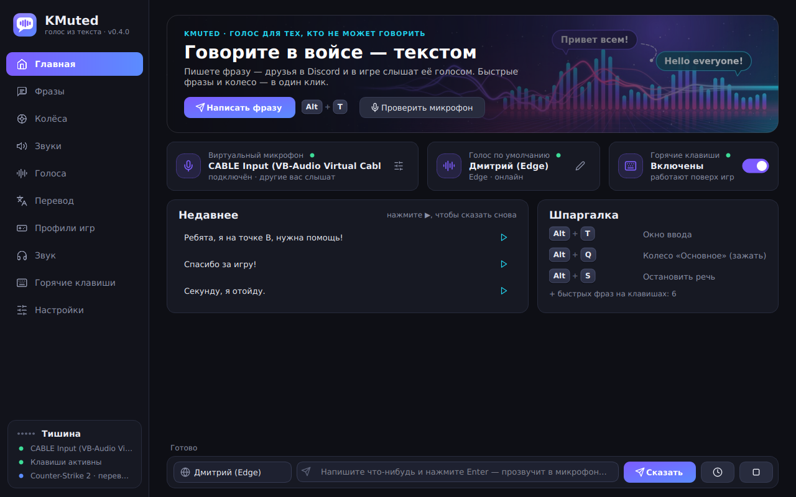
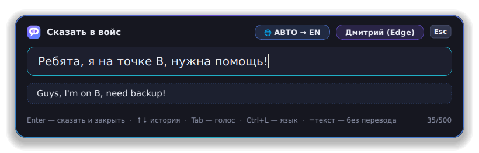
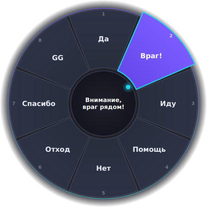
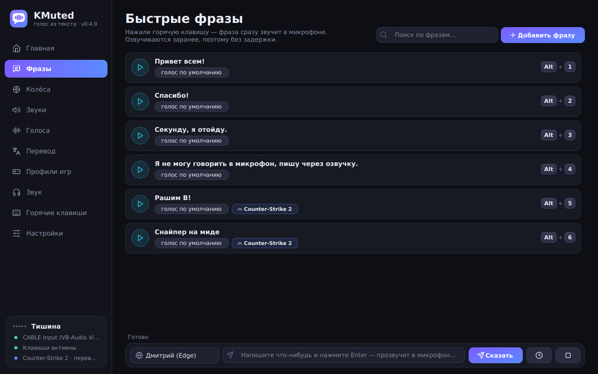
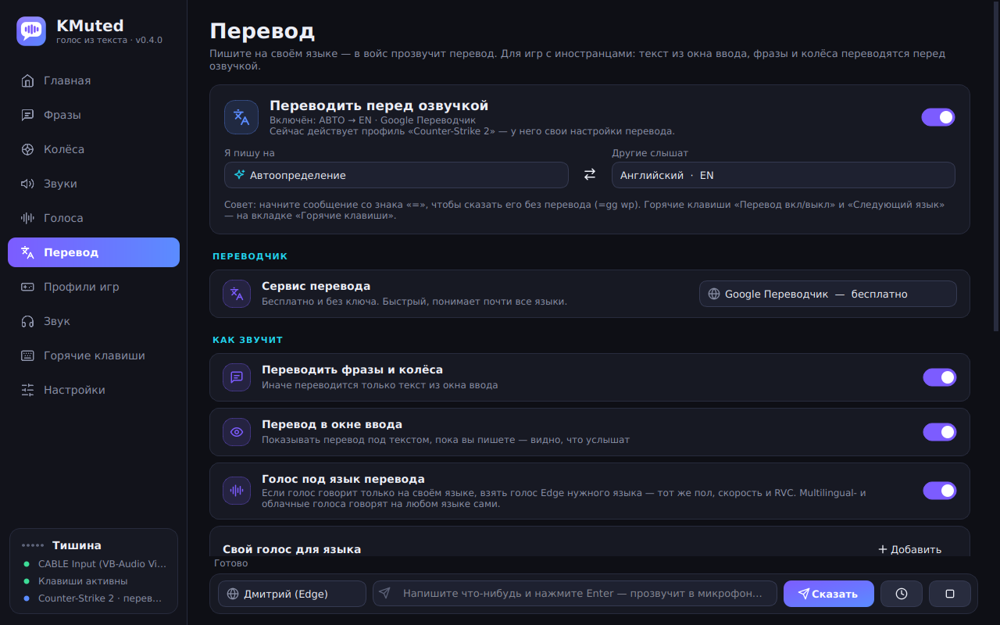
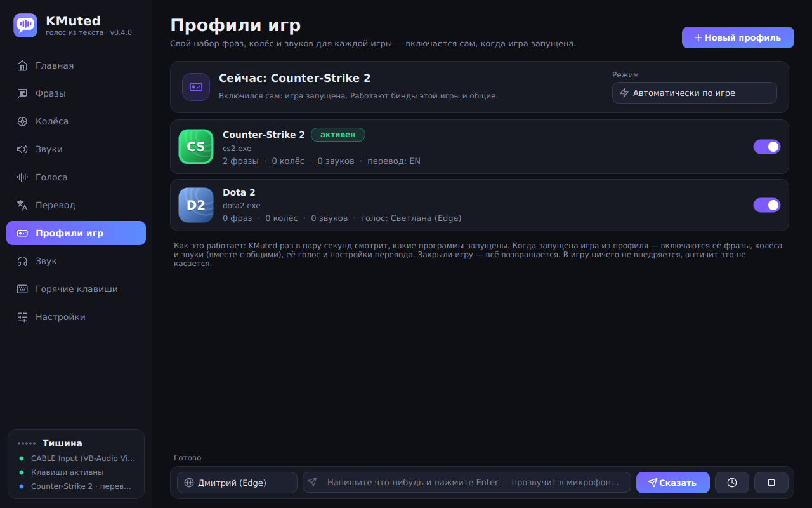

<p align="center">
  
</p>

# KMuted

**Русский** · [English](README.en.md)

**Говорите в войс-чате, не открывая рта.** KMuted озвучивает ваш текст выбранным голосом и
отправляет его прямо в микрофон — как звуки в Soundpad. Друзья в Discord или в игре слышат
голос, а не читают чат. А если играете с иностранцами — KMuted ещё и переведёт.

Для тех, кто не может говорить в микрофон (соседи спят, нет голоса, стесняетесь, немота),
но хочет участвовать в войсе.

**Версия 0.4.1** · Windows 10 / 11 (64-бит) · бесплатно · интерфейс на русском и английском

| | |
|---|---|
|  |   |

## Содержание

- [Быстрый старт](#быстрый-старт)
- [Что нового](#что-нового)
- [Возможности](#возможности)
- [Как это работает](#как-это-работает)
- [Установка и настройка](#установка)
- [Использование](#использование)
- [Автоперевод](#автоперевод)
- [Профили игр](#профили-игр)
- [Голоса](#голоса)
- [Настройки программы](#настройки-программы)
- [Частые проблемы](#частые-проблемы)
- [Приватность](#приватность)
- [Для разработчиков](#для-разработчиков)

## Быстрый старт

1. **[⬇ Скачайте KMuted (ZIP)](https://github.com/MarinZXCArtist/KMuted/archive/HEAD.zip)** — или на странице репозитория зелёная кнопка
   **Code → Download ZIP**.
2. Распакуйте архив (правой кнопкой → «Извлечь всё…») и откройте папку.
3. Дважды щёлкните **`run.bat`**. Первый запуск сам поставит Python (если его нет) и всё нужное —
   2–5 минут, нужен интернет. Дальше KMuted запускается тем же `run.bat` за пару секунд.
4. На «Главной» KMuted нажмите **«Скачать и установить VB-Cable»** (виртуальный микрофон, один раз)
   и перезагрузите компьютер.
5. В Discord или в игре выберите микрофон **CABLE Output**.
6. Нажмите `Alt + T`, напишите «Привет всем!» и нажмите `Enter` — друзья услышат голос.

Язык интерфейса берётся из языка Windows; поменять — Настройки → **«Язык интерфейса»**.

> Windows может показать «Windows защитила ваш компьютер» — нажмите **«Подробнее» →
> «Выполнить в любом случае»**. Так бывает с любыми файлами из интернета без платной подписи.

Дальше: повесьте свои фразы на клавиши (вкладка «Фразы»), настройте колесо (`Alt + Q`),
включите перевод (вкладка «Перевод») и создайте профиль под свою игру («Профили игр»).

## Что нового

**0.4.1**
- 🔊 **Звуки в колесе, как в Soundpad**: в редакторе колеса кнопка **«Звук из файла…»**, можно
  перетащить mp3/wav прямо на таблицу секторов, а **«Колесо из звуков»** собирает колесо из ваших звуков
  одной кнопкой.
- 🔄 **Обновление в один клик**: когда выходит новая версия, на главной появляется **«Обновить сейчас»** —
  KMuted сам скачает её и перезапустится. Работает и для установленной версии, и для копии из ZIP (`run.bat`).
- 🎙 **Голос Кавы** — «Готовые голоса» → «Кава (Максим)»: IVONA «Максим» с вашего компьютера или через новый
  движок **Amazon Polly**.

**0.4.0**
- 🌐 **Автоперевод** перед озвучкой: пишете на своём языке — в войсе звучит на другом
  (28 языков). Google и MyMemory бесплатно, DeepL, Claude и OpenAI — по ключу.
- 🎮 **Профили игр**: свои фразы, колёса и звуки включаются сами, когда запущена игра.
- В окнах фраз, колёс и звуков появилось поле **«Где работает»** (везде или только в выбранных играх).
- Новые картинки: баннер на «Главной» и центр колеса (нарисованы программно).
- В трее — переключатель «Переводить перед озвучкой», в боковой панели — текущий профиль и язык.
- `run.bat` сам ставит Python (через `winget`) и библиотеки — достаточно скачать ZIP и запустить.

**0.3.0** — саундборд (mp3/wav на клавишах), облачные голоса (ElevenLabs, OpenAI, Azure, Google,
Yandex), английский интерфейс, установщик и автообновления, страница «Горячие клавиши» с биндами на
всё, подстановки `{время}`, повтор последней фразы, наборы `.kmuted`, индикаторы уровня.

**0.2.0** — новый дизайн с анимациями, меньше памяти, исправления.
**0.1.0** — первая версия: быстрые фразы, колесо, окно ввода, голоса Edge / Windows / Piper, RVC.

## Возможности

| | |
|---|---|
| 💬 **Быстрые фразы** | Пишете свои фразы и вешаете их на горячие клавиши. Нажали — фраза звучит. Фразы озвучиваются заранее, поэтому играют мгновенно. |
| 🎡 **Колесо фраз** | Зажимаете клавишу — посреди экрана появляется колесо на 4–12 фраз. Ведёте мышью в сторону фразы, отпускаете — она звучит. Колёс может быть несколько. |
| ⌨️ **Окно ввода** | Горячая клавиша открывает поле по центру экрана: пишете текст, Enter — он озвучивается. ↑↓ — история, Tab — сменить голос. |
| 🌐 **Автоперевод** | Пишете по-русски — в войсе звучит по-английски (или на любом из 28 языков). Переводятся окно ввода, фразы и колёса; перевод виден прямо под текстом, пока пишете; голос сам подбирается под язык. Бесплатно (Google, MyMemory) или качественнее — DeepL, Claude, OpenAI. |
| 🎮 **Профили игр** | Свой набор фраз, колёс и звуков для каждой игры: запустили CS2 — включились коллауты для CS2, закрыли — вернулись обычные бинды. Можно сменить голос и язык перевода на время игры. 28 популярных игр в списке или любая запущенная программа. |
| 🗣 **Голоса** | Нейросетевые голоса Microsoft Edge (Дмитрий, Светлана и сотни других), голоса Windows, офлайн-голоса Piper. Скорость, высота, громкость. |
| 🧬 **Свои голоса** | Свои модели Piper (`.onnx`) и **RVC-модели из войс-ченджеров** (`.pth` + `.index`). |
| ☁️ **Облачные голоса** | ElevenLabs, OpenAI, Microsoft Azure, Google Cloud, Yandex SpeechKit, Amazon Polly — выбираются из списка, нужен свой ключ API (хранится зашифрованным). |
| 🎙 **Готовые голоса** | Одной кнопкой: «Кава (Максим)» — голос IVONA «Максим», как в роликах Кавы про Rust, — а также «Максим» и «Татьяна» (IVONA). |
| 🔊 **Звуки и мемы** | Саундборд: свои mp3 / wav / ogg / flac на горячих клавишах, прямо в микрофон, поверх речи. Файлы можно просто перетащить в окно. Звуки можно ставить и в сектора колеса. |
| ⌨️ **Бинды на всё** | Страница «Горячие клавиши»: окно ввода, повтор, стоп, звуки, смена голоса, перевод и язык, профиль игры, заглушить микрофон, прослушка, живой микрофон, громкость ±, пауза, показать окно — плюс клавиша на каждую фразу, колесо, звук и голос. Можно клавиши, сочетания и боковые кнопки мыши. |
| 🧩 **Подстановки** | `{время}`, `{дата}`, `{день}`, `{буфер}`, `{случайно:а\|б\|в}`, `{число:1-100}` прямо в тексте фраз. |
| 🎧 **Звук** | Вывод в виртуальный микрофон и одновременно в наушники; индикаторы уровня в реальном времени; можно подмешивать живой микрофон; автонажатие push-to-talk в играх. |
| 📦 **Наборы** | Экспорт и импорт фраз, колёс, звуков и голосов одним файлом `.kmuted` — делитесь с друзьями. |
| 🌍 **Русский и English** | Язык выбирается в установщике и меняется в настройках. 7 цветов акцента. |
| ✨ **Интерфейс** | Тёмная тема, главная со статусом и недавними фразами, анимированные колесо и окно ввода, уведомления, трей. Свои картинки — через папку [`assets`](assets/README.md). |
| 🔄 **Установщик и обновления** | Установщик на русском/английском, автозапуск с Windows, проверка и установка обновлений из GitHub Releases в один клик. |
| 🪶 **Лёгкий** | Страницы создаются при первом открытии, кэши ограничены, в трее KMuted отдаёт свободную память системе, анимации не крутятся впустую. |

| | |
|---|---|
|  |  |
|  | |

## Как это работает

```
 текст ─► [перевод] ─► голос (Edge / Windows / Piper / облако) ─► [RVC-модель] ─► CABLE Input ══► CABLE Output ─► Discord / игра
                                                                               └─► ваши наушники (прослушка)
```

Windows не даёт программам «говорить» в чужой микрофон напрямую. Поэтому KMuted использует
**виртуальный аудиокабель**: KMuted играет звук в его вход, а Discord или игра слушают его выход
как обычный микрофон. Кабель ставится один раз — на «Главной» есть кнопка, которая скачает
официальный установщик с vb-audio.com.

### А как Soundpad обходится без кабеля?

Soundpad **внедряет свою библиотеку (DLL) в процесс** программы, которая пишет микрофон
(Discord, игра), и подменяет звук прямо внутри неё. Так можно, но у этого способа серьёзные
минусы, поэтому KMuted так не делает:

- **античиты** (Vanguard, EasyAntiCheat, BattlEye, FACEIT) считают внедрение в процесс игры
  читом — можно получить кик или бан; сам Soundpad в таких играх советует ставить кабель;
- антивирусы часто ругаются на программы, которые внедряются в чужие процессы;
- нужен отдельный нативный код на C++ под каждую звуковую подсистему Windows, и он ломается
  при обновлениях Discord и игр.

Кабель — это обычный звуковой драйвер: он работает везде, одинаково в Discord и в играх и не
трогает процессы игр. Поэтому режима «внедрения в процессы» в KMuted нет.

## Установка

### 1. Виртуальный кабель (один раз)

Проще всего — кнопкой **«Скачать и установить VB-Cable»** на «Главной» KMuted, потом
**«Я установил — проверить»**. Вручную:

1. Скачайте бесплатный **[VB-Audio Virtual Cable](https://vb-audio.com/Cable/)**.
2. Распакуйте архив, запустите `VBCABLE_Setup_x64.exe` **от имени администратора**, нажмите *Install Driver*.
3. Перезагрузите компьютер.

### 2. KMuted

**Вариант А — ZIP и `run.bat` (работает прямо сейчас).**

1. [Скачайте ZIP](https://github.com/MarinZXCArtist/KMuted/archive/HEAD.zip) (или **Code → Download ZIP** на странице репозитория) и распакуйте его
   в любую папку, например `Документы\KMuted`. Запускать прямо из архива нельзя.
2. Дважды щёлкните **`run.bat`**. При первом запуске он:
   - найдёт Python 3.10–3.13, а если его нет — сам поставит Python 3.12 через `winget`
     (встроен в Windows 10/11);
   - создаст папку `.venv` рядом с собой и установит туда библиотеки (2–5 минут, нужен интернет).
3. Дальше просто запускайте `run.bat` — можно сделать на него ярлык на рабочем столе
   (правой кнопкой → «Отправить» → «Рабочий стол (создать ярлык)»).

Если `winget` нет (старая Windows 10) — поставьте [Python 3.12](https://www.python.org/downloads/windows/)
вручную с галочкой *Add python.exe to PATH* и снова запустите `run.bat`.

**Обновление — в самой программе.** Когда выходит новая версия, на «Главной» появляется
**«Обновить сейчас»** (и то же в Настройки → Обновления): KMuted скачает её, заменит свои файлы и
перезапустится. Папка `.venv`, настройки, фразы и звуки (`%APPDATA%\KMuted`) не трогаются.

**Вариант Б — установщик.** Когда на странице [Releases](https://github.com/MarinZXCArtist/KMuted/releases)
есть `KMuted-Setup-<версия>.exe` — можно ставить им: без Python, с ярлыками, автозапуском и
обновлениями в один клик.

**Вариант В — собрать самому.** `build.bat` → `dist\KMuted\KMuted.exe` (папка с программой, Python
для запуска уже не нужен); `build_installer.bat` → установщик `dist\KMuted-Setup-<версия>.exe`
(сам поставит [Inno Setup 6](https://jrsoftware.org/isdl.php) через `winget`, если его нет).

### 3. Настройка

1. На вкладке **«Звук»** в строке «Виртуальный микрофон» выберите **CABLE Input** (KMuted
   находит его сам при первом запуске). Нажмите «Проверить» — прозвучит тестовая фраза.
2. В **Discord**: *Настройки → Голос и видео → Устройство ввода* → **CABLE Output**.
   Лучше выключить шумоподавление (Krisp) и поставить низкий порог чувствительности или
   «Режим рации» с кнопкой (её KMuted может нажимать сам, см. ниже).
3. В **игре**: в настройках звука выберите микрофон **CABLE Output** (или «Устройство
   по умолчанию», если CABLE Output выбран микрофоном по умолчанию в Windows).

> Хотите иногда говорить и голосом? Вкладка «Звук» → «Живой микрофон» → включите
> **«Подмешивать мой настоящий микрофон»** — KMuted будет смешивать его с озвучкой.

## Использование

Горячие клавиши по умолчанию (всё меняется в программе):

| Клавиши | Действие |
|---|---|
| `Alt + T` | Окно ввода текста |
| `Alt + Q` (зажать) | Колесо фраз «Основное» |
| `Alt + 1…4` | Быстрые фразы |
| `Alt + R` | Повторить последнюю фразу |
| `Alt + S` | Остановить всё |
| `Ctrl + L` / `Ctrl + T` (в окне ввода) | Сменить язык перевода / перевод вкл-выкл |

Всё остальное (звуки, смена голоса, перевод, профили, «заглушить», прослушка, громкость…)
назначается на странице **«Горячие клавиши»** — там же видно, если клавиша занята дважды.

**Окно ввода:** `Enter` — сказать и закрыть, `Shift+Enter` — сказать и продолжить писать,
`↑`/`↓` — история, `Tab` — следующий голос, `Esc` — закрыть. Если включён перевод — под текстом
видно, что услышат другие; `=` в начале сообщения — сказать без перевода.

**Колесо:** зажмите клавишу, сдвиньте мышь в сторону нужной фразы (она подсветится) и
отпустите клавишу. Отпустили в центре — ничего не скажется. Работает даже в шутерах, где
курсор скрыт. В настройках можно включить режим «нажать → выбрать → нажать ещё раз».

**Звуки в колесе (как в Soundpad):** вкладка «Колёса» → выберите сектор → **«Звук из файла…»**, или
просто перетащите mp3/wav из папки на таблицу секторов (несколько файлов займут свободные сектора).
Кнопка **«Колесо из звуков»** создаёт колесо из всех ваших звуков. Звук из «Звуков» тоже можно выбрать
в списке под таблицей; на колесе такие сектора помечены ♪.

**Звуки:** вкладка «Звуки» → «Добавить звуки» или перетащите файлы в окно. Повторное нажатие
клавиши звука останавливает его. Звуки играют поверх речи и тоже зажимают кнопку рации.

**Подстановки в тексте:** `{время}` → «14:05», `{дата}` → «30 сентября», `{день}` → «среда»,
`{буфер}` → текст из буфера обмена, `{случайно:привет|здарова|ку}` → случайный вариант,
`{число:1-6}` → случайное число. По-английски: `{time}`, `{date}`, `{day}`, `{clipboard}`,
`{random:a|b}`, `{number:1-6}`.

**Push-to-talk в игре:** если в игре голос по кнопке (например `V` или `K`), укажите её на
вкладке «Звук» → **«Кнопка рации в игре (push-to-talk)»**. KMuted будет сам зажимать её, пока говорит.

**Наборы:** Настройки → «Поделиться с друзьями» → «Экспорт…» сохраняет фразы, колёса, звуки и
голоса в файл `.kmuted`; «Импорт…» добавляет чужой набор к вашему (или заменяет его).

### Советы для игр

- Окно ввода и колесо видны поверх игры в режиме **«Оконный»** или **«Без рамки»**
  (borderless). В эксклюзивном полноэкранном режиме Windows не показывает чужие окна.
- Горячие клавиши **не блокируются** для игры — выбирайте сочетания, которые игра не
  использует: `Alt + цифры`, `F`-клавиши, боковые кнопки мыши.
- Если игра запущена **от администратора**, KMuted тоже нужно запускать от администратора,
  иначе Windows не передаст ему нажатия клавиш.

## Автоперевод

Вкладка **«Перевод»**: включите «Переводить перед озвучкой», выберите «Я пишу на» (или
«Автоопределение») и «Другие слышат». Дальше просто пишите как обычно — в войсе прозвучит перевод.

| Переводчик | Стоимость | Чем хорош |
|---|---|---|
| **Google Переводчик** | бесплатно, без ключа | Быстрый, почти все языки |
| **MyMemory** | бесплатно, без ключа (~5 000 символов в день, 50 000 с e-mail) | Запасной бесплатный вариант |
| **DeepL** | бесплатно до 500 000 символов в месяц, нужен ключ | Очень естественный перевод, вежливость «ты/вы» |
| **Claude (Anthropic)** | платно, центы за тысячи фраз | ИИ: понимает сленг и игровой контекст, следует стилю и вашим пожеланиям |
| **OpenAI** | платно, центы за тысячи фраз | ИИ на моделях GPT, тот же ключ, что у голосов OpenAI |

- **Стиль для ИИ:** «естественно, как носитель», «игровой сленг», «вежливо», «максимально коротко»
  и поле «Пожелания для ИИ» (например, «названия карт не переводить»). Пример:
  «го на бэ, у них никого» → «Push B, they've got nobody there!».
- **Claude:** по умолчанию Claude Opus 5.5 (лучшее качество), можно выбрать Sonnet 5.5 (быстрее и
  дешевле) или Haiku 4.5 (самый быстрый). Для Opus и Sonnet включён запасной режим Anthropic:
  если модель откажется переводить фразу, запрос автоматически уйдёт на другую модель.
- **Видно заранее:** пока вы пишете, под текстом в окне ввода видно, что услышат другие.
  `Ctrl+L` — сменить язык (по кругу из отмеченных в «Быстром переключении»), `Ctrl+T` — выключить
  перевод, `=` в начале — сказать без перевода (`=gg wp`).
- **Голос под язык:** русский голос не будет читать английский текст с акцентом — KMuted возьмёт
  голос Edge нужного языка (того же пола, с вашими скоростью, высотой и RVC). Multilingual- и
  облачные голоса говорят на любом языке сами. В «Свой голос для языка» можно задать голос для
  каждого языка.
- **Быстро:** переводы запоминаются, так что фразы и колёса после первого раза звучат мгновенно.
  Если перевод не удался (нет интернета, закончился лимит), фраза звучит как написана, а KMuted
  об этом скажет.
- Ключи хранятся зашифрованными, как и у облачных голосов. Внизу вкладки есть поле «Попробовать»,
  чтобы проверить перевод.

## Профили игр

Вкладка **«Профили игр»** → «Новый профиль» → выберите игру из **«Популярные игры»**, из
**«Из запущенных»** или через **«Указать .exe…»**. Отметьте фразы, колёса и звуки этой игры.
Всё, что не отмечено ни в одной игре, работает везде.

- Когда игра запущена, её бинды включаются сами (KMuted раз в пару секунд смотрит список
  процессов — в игру ничего не внедряется, античиту нечего замечать). Если запущено несколько
  игр, побеждает та, что на переднем плане. Закрыли игру — вернулись обычные бинды.
- Одна и та же клавиша может означать разное в разных играх: `Alt+1` — «rush B» в CS2 и
  «нужен вард» в Dota. Бинд игры важнее общего бинда на той же клавише.
- В профиле можно задать **голос на время игры** и **перевод** (например, всегда на английский в
  CS2). После игры вернётся ваш обычный голос.
- **Режим:** «Автоматически по игре», «Выключены» или «Всегда «такой-то профиль»». Клавиша
  «Следующий профиль игры» переключает их по кругу.
- Привязать фразу, колесо или звук к игре можно и в их собственных окнах — поле **«Где работает»**.
- Список популярных игр: CS2, Dota 2, Valorant, Fortnite, Apex Legends, PUBG, Rust, GTA V,
  League of Legends, Overwatch 2, Rainbow Six Siege, Escape from Tarkov, Marvel Rivals, Call of Duty,
  Deadlock, Rocket League, Minecraft, Roblox, World of Tanks, Dead by Daylight, Among Us,
  Lethal Company, Phasmophobia, Helldivers 2, Sea of Thieves, Hunt: Showdown, Warframe, Genshin Impact.
  Если игры нет в списке — запустите её и выберите в «Из запущенных».

## Голоса

На вкладке **«Голоса»** можно создать сколько угодно голосов и переключаться между ними
(«Сделать основным», клавиша на каждый голос, `Tab` в окне ввода).

| Движок | Интернет | Особенности |
|---|---|---|
| **Edge** | нужен | Бесплатные нейросетевые голоса Microsoft: `Дмитрий`, `Светлана` и 400+ голосов на других языках. Голоса *Multilingual* (Andrew, Emma, Florian…) говорят на любом языке. |
| **Windows** | нет | Голоса, установленные в системе (например *Microsoft Irina*). Больше голосов: *Параметры → Время и язык → Речь → Добавить голоса*. |
| **Piper** | нет | Быстрые офлайн-нейросети. Кнопка **«Скачать голоса…»** открывает каталог (русские: *irina, denis, dmitri, ruslan*). Можно добавить **любую свою модель** Piper: «Своя модель .onnx…» (файл `.onnx` + `.onnx.json`). |

### Облачные голоса: что выбрать

Выбираются на вкладке «Голоса» → «Движок». Ключ API вставляется там же (кнопка «Получить ключ»
ведёт на страницу сервиса). Ключи хранятся зашифрованными средствами Windows (DPAPI).
Цены и лимиты меняются — сверяйтесь с сайтом сервиса.

| Сервис | Стоимость | Чем хорош |
|---|---|---|
| **Edge** (встроен) | бесплатно | Хорошие нейроголоса без ключа, нужен интернет |
| **Piper** (встроен) | бесплатно | Офлайн, свои модели, быстро |
| **Windows** (встроен) | бесплатно | Офлайн, голоса системы |
| **Microsoft Azure** | бесплатный тариф F0 с месячным лимитом | Те же голоса, что Edge, официально и стабильно |
| **Google Cloud** | бесплатный месячный лимит, дальше за символы | WaveNet / Neural2 / Chirp |
| **OpenAI** | оплата за символы, обычно дешевле ElevenLabs | Живые многоязычные голоса |
| **Yandex SpeechKit** | оплата за символы, стартовый грант | Лучшие русские голоса |
| **ElevenLabs** | бесплатный лимит, дальше подписка | Самые живые голоса + ваши голоса из аккаунта ElevenLabs |
| **Amazon Polly** | первые 12 месяцев 5 млн символов в месяц бесплатно, дальше ~4 $ за 1 млн | Классические голоса IVONA: «Максим» (как у Кавы) и «Татьяна» |

Платные голоса не озвучивают фразы заранее, чтобы не тратить ваши символы: фраза синтезируется
при первом нажатии и дальше берётся из кэша.

### Голос Кавы (IVONA «Максим»)

Голос из роликов Кавы про Rust («ДержиДверь») — это классический синтезатор **IVONA «Максим»**,
немного ускоренный. Вложить сам голос в KMuted нельзя: он платный и закрытый (IVONA теперь
принадлежит Amazon). Поэтому KMuted берёт того же «Максима» оттуда, где он у вас есть:

1. Вкладка «Голоса» → **«Готовые голоса» → «Кава (Максим)»**.
2. Если на компьютере установлен голос **IVONA 2 Maxim**, KMuted найдёт его сам — работает без
   интернета и бесплатно.
3. Если нет — голос добавится через **Amazon Polly** (там тот же «Максим»). Нужны ключи AWS:
   создайте аккаунт на [aws.amazon.com](https://aws.amazon.com/), в разделе
   *Security credentials* создайте *Access key* и вставьте **Access key ID** и **Secret access key**
   в поля под движком. Первые 12 месяцев — 5 млн символов в месяц бесплатно (это десятки тысяч фраз),
   дальше около 4 $ за миллион символов.

Скорость в пресете +12 %; высоту и скорость можно подкрутить на той же вкладке. Там же есть
«Максим (IVONA)» без изменений и женский голос «Татьяна (IVONA)».

### Свои голоса из войс-ченджеров (RVC)

Большинство голосов для AI войс-ченджеров — это **RVC-модели** (`.pth` + `.index`). KMuted
умеет пропускать озвучку через такую модель: текст → голос Edge/Piper → ваша RVC-модель → микрофон.

RVC требует PyTorch (несколько гигабайт), поэтому работает отдельным локальным сервером:

1. Установите **[Python 3.10](https://www.python.org/downloads/release/python-31011/)**
   (именно 3.10 — так требует RVC).
2. Положите каждую модель в свою папку:
   `%APPDATA%\KMuted\voices\rvc\ИмяМодели\model.pth` (+ `*.index`, если есть).
   Кнопка «Папка моделей» на вкладке «Голоса» открывает её.
3. Запустите **`start_rvc_server.bat`** и не закрывайте окно. Первый запуск скачивает
   ~2–3 ГБ. С видеокартой NVIDIA работает намного быстрее.
4. В KMuted: вкладка «Голоса» → группа «Свой голос через RVC» → включите «Пропускать озвучку
   через RVC-модель» → ⟳ → выберите модель. Сдвиг тона: мужской голос → женская модель `+12`,
   наоборот `-12`.

Озвучка через RVC занимает от доли секунды (GPU) до нескольких секунд (CPU). Фразы с
горячих клавиш и колёс озвучиваются заранее и всё равно звучат мгновенно.

> ⚠️ Используйте модели, на которые у вас есть права, и не выдавайте себя за других людей.

## Настройки программы

**Вкладка «Звук»:** виртуальный микрофон и громкость в нём, «Заглушить KMuted в микрофоне»,
прослушка в наушниках (устройство и громкость), индикаторы уровня, «Новая фраза, пока звучит
старая» (дождаться или перебить), кнопка рации в игре и её задержки, живой микрофон.

**Вкладка «Настройки»:**
- *Внешний вид* — язык интерфейса (Русский / English) и цвет акцента (7 вариантов).
- *Окна поверх игры* — где появляется окно ввода (сверху / по центру / снизу), не закрывать после
  отправки, возвращать фокус в игру, колесо: как выбирать (зажать или нажать дважды), размер,
  мёртвая зона.
- *Приложение* — запуск вместе с Windows, запуск свёрнутым, крестик сворачивает в трей.
- *Обновления* — проверять автоматически (раз в день), «Проверить», «Обновить», «Пропустить».
- *Наборы* — экспорт и импорт `.kmuted`.
- *Данные* — папка настроек, очистить кэш, адрес RVC-сервера.

Свои картинки (логотип, баннер, центр колеса, иконки) — см. [`assets/README.md`](assets/README.md).

## Частые проблемы

| Проблема | Решение |
|---|---|
| Друзья меня не слышат | В Discord/игре микрофон должен быть **CABLE Output**, а в KMuted — **CABLE Input**. Проверьте порог чувствительности в Discord и что KMuted не заглушён. |
| Я не слышу озвучку | Вкладка «Звук» → «Прослушка в наушниках»: включите и выберите свои наушники. |
| Горячие клавиши не работают в игре | Запустите KMuted от администратора. Проверьте, что клавиши не на паузе (значок в трее). |
| Окно/колесо не видно в игре | Переключите игру в «Оконный» или «Без рамки». |
| «Edge TTS: …» ошибка | Нет интернета или сервис недоступен — выберите голос Windows или Piper. |
| Перевод не работает | Проверьте интернет. «Google временно ограничил запросы» — подождите или выберите MyMemory/DeepL. Для DeepL, Claude и OpenAI нужен ключ на вкладке «Перевод». |
| Перевод с акцентом / не тем голосом | Включите «Голос под язык перевода» или задайте «Свой голос для языка». |
| Профиль игры не включается | Проверьте имя `.exe` (Диспетчер задач → «Подробности») и что режим профилей — «Автоматически по игре», а сам профиль включён. |
| Звук с треском или задержкой | Нажмите «Обновить устройства» на вкладке «Звук» или перезапустите KMuted. |

Настройки, кэш и модели лежат в `%APPDATA%\KMuted` (Настройки → «Папка настроек»).
Если рядом с `KMuted.exe` создать папку `data`, всё будет храниться в ней (портативный режим).

## Приватность

- KMuted ничего не собирает и никуда не отправляет, кроме того, что нужно для работы:
  текст — выбранному голосовому сервису (Edge или облачный голос) и, если включён перевод,
  выбранному переводчику. Голоса Windows и Piper работают полностью офлайн.
- Ключи API хранятся на вашем компьютере, зашифрованные средствами Windows (DPAPI).
- Проверка обновлений — раз в день запрос к GitHub Releases (отключается в настройках).
- Профили игр только читают список запущенных программ; в игры ничего не внедряется.

## Для разработчиков

```bash
pip install -r requirements.txt -r requirements-dev.txt
python -m kmuted                  # запуск (--no-hotkeys, --no-audio, --verbose)
python -m pytest                  # тесты (QT_QPA_PLATFORM=offscreen)
python tools/build_exe.py         # сборка exe
python tools/make_assets.py       # перерисовать баннер и центр колеса
python tools/make_screenshots.py  # скриншоты для README (docs/screenshots)
```

```
kmuted/
  app.py            точка входа: трей, одна копия программы, лог
  controller.py     связка: горячие клавиши → оверлеи → перевод → синтез → звук; профили игр
  config.py         настройки (JSON, терпимая загрузка)
  translate.py      автоперевод: Google, MyMemory, DeepL, Claude, OpenAI; кэш; голос под язык
  processes.py      какие программы запущены (профили игр), список популярных игр
  cable.py          помощь с установкой VB-Cable
  actions.py        все действия, которые можно забиндить
  textvars.py       подстановки {время}, {дата}, …
  presets.py        экспорт/импорт наборов .kmuted
  updater.py        обновления из GitHub Releases
  i18n.py           язык интерфейса (i18n_en.py — английские строки)
  keystore.py       шифрование ключей API (DPAPI)
  rawinput.py       движение мыши для колеса (Raw Input, курсор может быть заблокирован)
  hotkeys/          глобальный перехват (pynput), имена клавиш, push-to-talk
  audio/            устройства, микшер, вывод в кабель и наушники
  tts/              Edge, Windows SAPI, Piper, облачные сервисы, RVC-клиент, кэш
  ui/               окно, страницы, компоненты, иконки, оверлеи (поле ввода, колесо)
assets/             баннер и центр колеса (tools/make_assets.py); свои картинки — см. assets/README.md
docs/screenshots/   скриншоты для README (tools/make_screenshots.py)
installer/          скрипт установщика Inno Setup (RU/EN)
```

Каждый пуш собирается на Windows в GitHub Actions (тесты, exe, установщик).

**Как выпустить версию:** поднимите номер в `kmuted/__init__.py` (например `0.4.2`), добавьте раздел
`## 0.4.2` в [`CHANGELOG.md`](CHANGELOG.md) и запушьте в основную ветку. Сборка сама опубликует релиз
`v0.4.2` с установщиком и портативным ZIP, а у пользователей появится кнопка «Обновить сейчас» (текст
из `CHANGELOG.md` показывается как «что нового»). Пуш тега `v*` тоже публикует релиз.
Новые строки интерфейса пишутся по-русски в `tr("…")`, английский перевод добавляется в
`kmuted/i18n_en.py`; `python tools/i18n_strings.py --missing` показывает, чего не хватает.
Документация: этот файл и [README.en.md](README.en.md) — меняйте их вместе.
